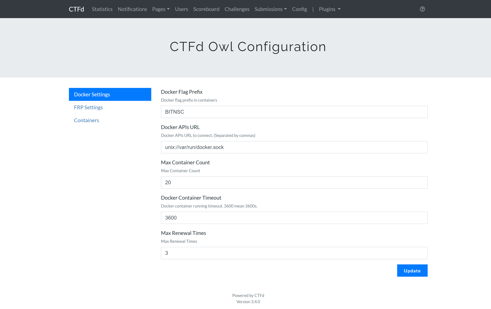
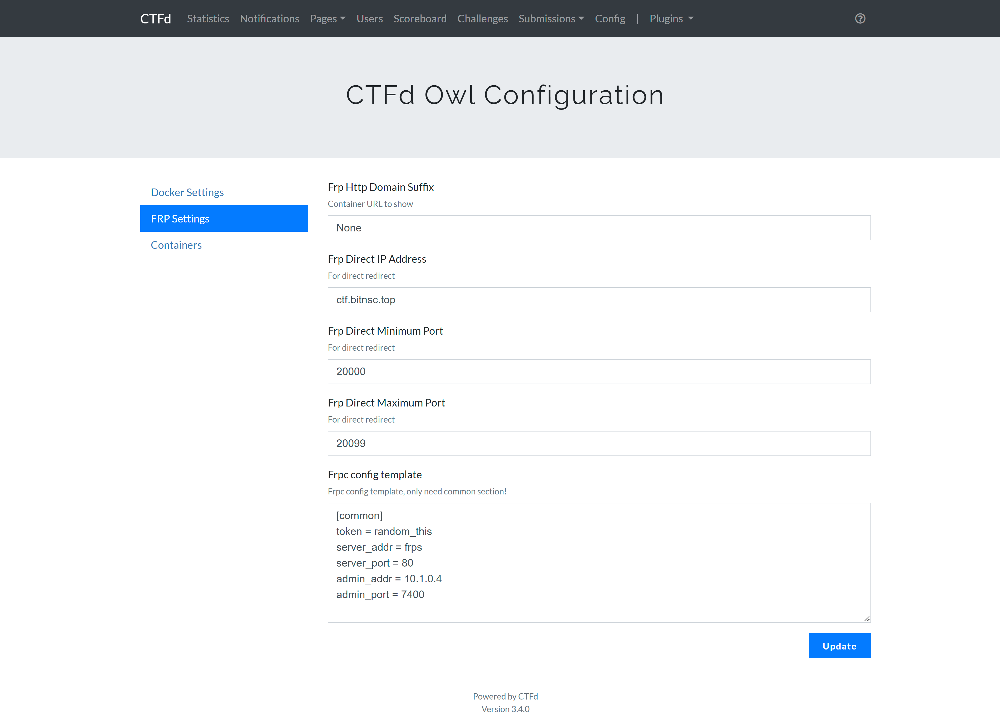
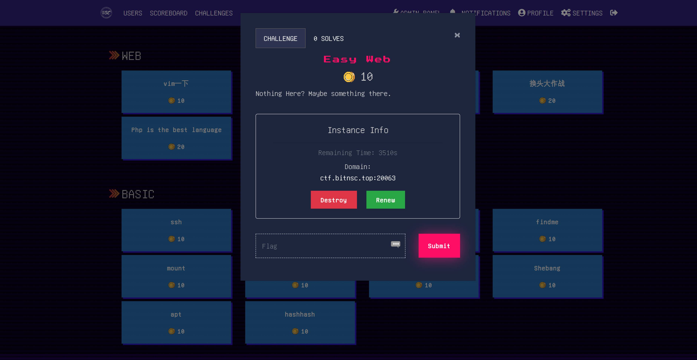
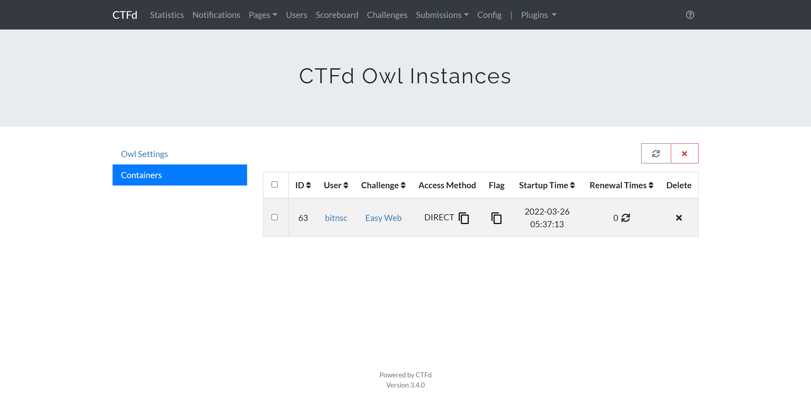

# CTFd-owl

**Dynamic Check Challenges with docker-compose for CTFd**

Modify from [H1ve/CTFd/plugins/ctfd-owl](https://github.com/D0g3-Lab/H1ve/tree/master/CTFd/plugins/ctfd-owl) and [CTFd-Whale](https://github.com/frankli0324/CTFd-Whale). 

适合的 CTFd 版本： **Version 3.4.0**.(如果你想使用 **V3.4.2+**, 请先阅读 [使用 V3.4.2+ 版本](https://github.com/BIT-NSC/CTFd-owl/wiki/%E4%B8%80%E4%BA%9B%E5%B8%B8%E8%A7%81%E9%97%AE%E9%A2%98#%E4%BD%BF%E7%94%A8-v342-%E7%89%88%E6%9C%AC))

## Features

1. 每次 launch 容器时端口随机。

2. 适配了 `teams` 和 `users` 模式. 在 `teams` 模式中, 同一个队的用户会使用同一个容器.

3. Flag 可以是动态生成的(`dynamic`)，或者像正常题目一样添加静态的(`static`).

......

## Installation

**REQUIRES: CTFd >= v3.4.0**

如果你之前没有使用过 CTFd（请保证下面的命令都是以 root 权限执行）：

```shell
# install docker
curl -fsSL https://get.docker.com -o get-docker.sh
sh get-docker.sh

# replace <workdir> to your workdir
cd <workdir>
git clone https://github.com/CTFd/CTFd.git -b 3.4.0
git clone https://github.com/BIT-NSC/ctfd-owl.git
# replace file in CTFd
mv -f ctfd-owl/* CTFd
mkdir -p /home/docker

# make sure you have pip3 installed on your server
pip3 install docker-compose
```

上面的命令会尝试安装 `docker-ce`，`python3-pip` 和 `docker-compose`。 在执行它们之前，请确保满足以下要求：

* 安装了 `curl`、`git`、`python3` 和 `pip`
* GitHub 可访问（可尝试国内镜像站或手动通过其他方式下载）
* Docker Registry 是可访问的（可以换源为国内镜像）

如果要使用 nginx，请使用 `single-nginx.yml`，否则使用 `single.yml`（nginx的配置请在`conf`下自行修改）。

请在您要使用的 `*.yml` 中随机生成 `SECRET_KEY`、`MYSQL_PASSWORD` 等敏感信息。

```shell
# if you want to use nginx
docker-compose -f CTFd/single-nginx.yml up -d
# or no nginx
docker-compose -f CTFd/single.yml up -d
# wait till the containers are ready
```

然后，您可以访问 `localhost` 使用 `CTFd-owl` 去利用 `docker-compose` 为 CTFd 部署动态容器的题目。

## How to Use

### Configuration

参见图片和表格进行默认配置。

#### Docker Settings



|Options|Content|
|:-:|:-:|
|**Docker Flag Prefix**|Flag前缀|
|**Docker APIs URL**|API名称（默认为`unix://var/run/docker.sock`）|
|**Max Container Count**|最大容器数量（默认无限制）|
|**Docker Container Timeout**|容器最长运行时间（达到时间后会自动摧毁）|
|**Max Renewal Time**|最大容器延长次数（超过次数将无法延长）|

#### FRP Settings




|Options|Content|
|:-:|:-:|
|**FRP Http Domain Suffix**|FRP域名前缀（如开启动态域名转发必填）|
|**FRP Direct IP Address**|frp服务器IP|
|**FRP Direct Minimum Port**|最小端口（保持和`docker-compose`中`frps`对外映射的端口段最小一致）|
|**FRP Direct Maximum Port**|最大端口（与上同理）|
|**FRP config template**|frpc 热重载配置头模版(如不会自定义，尽量按照默认配置)|

`token` 请随机生成，替换掉`random_this`，并修改`frp/conf/frps.ini`中的`token` 与其一致.

```ini
[common]
token = random_this
server_addr = frps
server_port = 80
admin_addr = 10.1.0.4
admin_port = 7400
```

### Add Challenge

详见[添加题目 - Wiki](https://github.com/BIT-NSC/CTFd-owl/wiki/%E4%B8%80%E4%BA%9B%E5%B8%B8%E8%A7%81%E9%97%AE%E9%A2%98#%E6%B7%BB%E5%8A%A0%E9%A2%98%E7%9B%AE).

### Demo

下图的主题为[CTFd-theme-pixo](https://github.com/BIT-NSC/CTFd-theme-pixo)





## Twins

* [CTFd-Whale](https://github.com/frankli0324/CTFd-Whale) (Support docker-swarm)